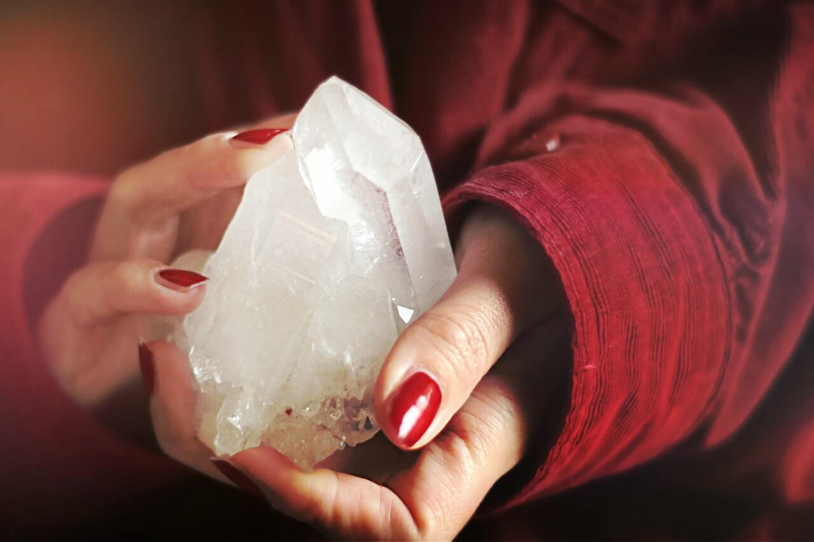

<!-- Main -->

<!-- REIKI -->
<section id="reikisection">
	

		<header class="major">
			<h1>Reiki</h1>
		</header>
		

		Reiki is a spiritual healing practice developed in 1922 by Dr. Mikao Usui in Japan. The word “Rei” means Universal, and “Ki” means life force energy. Reiki energy is channelled from the Practitioner to the patient in two ways i.e. hands-on technique and distance healing. Reiki energy targets the energy fields around the body.
		

	

</section>

<!-- Two -->
<section id="two" class="spotlights">
	<section>
		
		

			

				<header class="major">
					<h3>How does Reiki work?</h3>
				</header>
				

				Energy can stagnate in the body and could create blockages in a person’s emotional and physical wellbeing. The energy blockages can further be a cause of illness. Reiki aims to unblock the stagnant energy or remove any kind of imbalances. It brings relaxation, eases the pain, speeds up recovery and much more. Reiki also compliments medical treatment and other therapies.
				

				<!-- <ul class="actions">
					<li><a href="generic.html" class="button">Learn more</a></li>
				</ul> -->
			

		

	</section>
	<section>
		
		

			

				<header class="major">
					<h3>What can you experience in a Reiki healing session?</h3>
				</header>
				

					<ul>
						<li> Reduced stress, anxiety and brings in peace</li>
						<li> Promoting balance by harmonizing and restoring energy system by removing mental and emotional blocks.</li>
						<li> Helping the elimination of toxins from the body</li>
						<li> Helping in releasing suppressed emotions</li>
						<li> Helps in healing at all levels - physical, mental, emotional and spiritual</li>
						<li> Promoting natural balance between mind, body, and spirit</li>
					</ul>
				

				<!-- <ul class="actions">
					<li><a href="generic.html" class="button">Learn more</a></li>
				</ul> -->
			

		

	</section>
</section>

<section>
	

		<header class="major">
			<h2>Uplift yourself to experience more abundance, peace, and happiness, by booking a session or enrolling for a workshop. </h2>
			<h3>So, hurry up to experience the healing power of Reiki energy today. </h3>
		</header>
	

</section>

<section>
	

		<header class="major">
			<h1>Workshops</h1>
		</header>
	

</section>

<section class="workshops">
	

		<header class="major">
			<h2>Reiki Level I- Two Day Workshop</h2>
		</header>
		

			<ul>
				<li>Introduction to Reiki and information about Chakras</li>
				<li>Principles of Reiki</li>
				<li>Knowledge on how to heal self and others using a hands-on technique</li>
				<li>Meditation</li>
				<li>Energy Balancing</li>
				<li>Manual</li>
				<li>Level I Certificate</li>
			</ul>
		

	

</section>
<section class="workshops">
	

		<header class="major">
			<h2>Reiki Level II- Two Day Workshop</h2>
		</header>
		

			<ul>
				<li>Distance Scanning and Healing</li>
				<li>Shielding with Reiki for self, loved ones, house, business, valuables, etc.</li>
				<li>Energizing home and office</li>
				<li>Chakra Meditation for aligning and balancing chakras, etc.</li>
				<li>Manual</li>
				<li>Level II Certificate</li>
			</ul>
		

	

</section>
<section class="workshops">
	

		<header class="major">
			<h2>Reiki Level III – Two Day Workshop</h2>
		</header>
		

			<ul>
				<li>Tapping into the Third Eye</li>
				<li>Healing Chakras</li>
				<li>Aura scanning</li>
				<li>Quick ways of healing in distance</li>
				<li>Third Eye meditation with Crystal Pyramid and much more.</li>
				<li>Manual</li>
				<li>Level III Certificate</li>
			</ul>
		

		
Reiki Master Teacher

		
Reiki Grand Teacher

		
For more details on workshop and healing session contact +91 9833 77 97 35 or email us at <a href="mailto:thezivah@gmail.com">thezivah@gmail.com</a>

	

</section>

<!-- Angelic Healing Section -->
<section id="angelicsection">
	

		<header class="major">
			<h1>Angelic Healing</h1>
		</header>
			

			Did you know every being on earth is guarded by their angles, and many of us aren’t even aware of this divine power. Angels are celestial beings and messengers of God. They act as mediators between humans and God. Angelic Healing is a powerful, useful, and safe means that helps us in gaining heavenly guidance and assistance in times of need. Angels are directed towards human benefit for their protection and healing in every aspect of life.
	 		

			

			The Archangels and Guardian Angels who always surround us are overseen by the ‘Universal Law of Free Will’ which means they can intervene only when given permission. Angels always guide us in our highest and greatest good with unconditional love and compassion. You can use Angelic Healing for the highest good of yourself and everyone involved. Angelic healing helps to uplift all areas of your life, therefore, to call upon your guardian angels learn this powerful healing modality and experience the magic!
			

	

</section>

<section class="workshops">
	

		<header class="major">
			<h2>Angelic Healing Workshop</h2>
		</header>
		

			<ul>
				<li>All About Angels</li>
				<li>Archangels</li>
				<li>Receive Answers and Guidance by connecting with Guardian Angels for self and others</li>
				<li>Aura Scanning</li>
				<li>Angel Healing</li>
				<li>Angel Oracle Card Reading</li>
				<li>Past Life Regression with Angels</li>
				<li>Mediumship</li>
				<li>Removing Psychic hooks and Clearing Aura</li>
				<li>Angel Numbers and meaning</li>
				<li>Inner Child Healing</li>
				<li>House Cleansing with Angels</li>
				<li>Manual</li>
				<li>Certificate</li>
			</ul>
		

		
For more details on workshop and healing session contact +91 9833 77 97 35 or email us at <a href="mailto:thezivah@gmail.com">thezivah@gmail.com</a>

	

</section>

<!-- Akashic Records Section -->
<section id="akashicsection">
	

		<header class="major">
			<h1>Akashic Records Reading</h1>
		</header>
			

			Akashic records are the record of a soul’s journey from the beginning of time and have been referred to as the “Book of Remembrance” in Torah, “The Book of Life” in Bible, Yamaraj’s assistant Chitragupta’s “Book of Karma” in Hindu scriptures.
	 		

			

			Akashic is derived from the Sanskrit word “Akasha” which means ether or space. The Akashic record is a collection of a soul’s emotions, actions, thoughts, words, events, intent that has ever occurred in each lifetime. Your masters, guides, teachers, and the beings of light keep a track of this information for you.
			

			

			By accessing the Akashic Records you receive knowledge and information that supports in our growth at all levels. Akashic records reading reveal the specific details that are required at this point in your soul’s journey. It also reveals events from the past that needs to be healed and released.
			

			

			Akashic reading sessions are the most uplifting and helpful. Anyone can do Akashic reading for the betterment of their life. However, if you are going through the below-mentioned life situations, then you should book a session to emerge, as a whole, happy and beautiful human you are supposed to be.
			

			

				<ul class="actions">
					<li><a href="#akashikworkshops" class="button next scrolly">Learn more</a></li>
				</ul>
			

	

</section>

<section id="two" class="spotlights">
	<section>
		
		

			

				<header class="major">
					<h3>Are you experiencing any of the following circumstances?</h3>
				</header>
				

					<ul>
						<li>Feeling Frustrated and stuck in your life?</li>
						<li>No clarity regarding your professional life?</li>
						<li>Recurring life patterns (Personal or Professional)?</li>
						<li>Financial Losses?</li>
						<li>Difficulties in your relationships?</li>
						<li>Experiencing lower emotions like anger, sadness, jealousy, revenge, etc.?</li>
					</ul>
				

			

		

	</section>
</section>

<section class="workshops" id="akashikworkshops">
	

		<header class="major">
			<h2>What to Expect from an Akashic Records Session?</h2>
		</header>
		

			<ul>
				<li>Understanding the root cause of recurring issues</li>
				<li>Bringing positive change into your lifestyle</li>
				<li>Understanding your soul purpose</li>
				<li>Understanding life at a deeper leve</li>
				<li>Access profound levels of creativity andclarity of thought</li>
				<li>Knowing your life purpose</li>
				<li>Information on Ancestral Linege</li>
			</ul>
		

		

		Akashic Records an interactive session, where you can ask questions and receive reading accordingly. Records enlighten us on our current situation and give guidance for our future path, bringing in peace, harmony, happiness, and joy. As we are the architect of our own destiny, we can build a better future.
		

		
To get a guidance book an Akashic session with us. Contact +91 9833 77 97 35 or email us at <a href="mailto:thezivah@gmail.com">thezivah@gmail.com</a>

	

</section>

<!-- Crystal Healing Section -->
<section id="crystalsection">
	

		<header class="major">
			<h1>Crystal Healing</h1>
		</header>
			

			Crystal healing is an alternative healing technique that uses semi-precious stones and crystals such as Quartz, Amethyst, etc. These crystal are found in various combination of minerals that give them a specific color, shape, and identity which decides its healing property. Crystals are energy amplifiers, therefore they help to cure acute and chronic ailments and protect against diseases. Human and crystals have water element, therefore the human body reacts very well when healed with crystals.
	 		

			

				<ul class="actions">
					<li><a href="#crystalworkshops" class="button next scrolly">Learn more</a></li>
				</ul>
			

	

</section>

<section id="two" class="spotlights">
	<section>
		
		

			

				

				Use of crystal for the healing purpose was extensive during ancient times, and even today people wear or carry the precious or semi-precious stones for healing and protection. Crystal or Crystal Healing work wonders if;
				

			

		

	</section>
	<section>
		
		

			

				

				If you want more abundance in business or job, open the ways of earning and material benefits, want happy and peaceful relationships, protection against low or bad energies, harmony at home and office, remove any recurring health issue, then immediately book a crystal healing session with us or enrol for a crystal healing workshop.
				

			

		

	</section>
</section>

<section class="workshops" id="crystalworkshops">
	

		<header class="major">
			<h2>Attending a crystal healing workshop offers the following benefits</h2>
		</header>
		

			<ul>
				<li>Clarity in thought</li>
				<li>Promotes a positive outlook in life</li>
				<li>Accelerates healing</li>
				<li>Reduces aches and pains</li>
				<li>Calms mind by eliminating stress</li>
				<li>Heals aura, mind and body</li>
				<li>Shielding against bad energies</li>
				<li>Promotes abundance and growth in all aspects of life</li>
				<li>Removes blockages and clears chakras</li>

			</ul>
		

		
To get a guidance book a crystal session with us. Contact +91 9833 77 97 35 or email us at <a href="mailto:thezivah@gmail.com">thezivah@gmail.com</a>

	

</section>

<!-- Yoga Section -->
<section id="yogasection">
	

		<header class="major">
			<h1>Yoga</h1>
		</header>
		

		The word ‘Yoga’ means Union in Sanskrit. The practice of yoga leads to the union of a person with his true essence. The Spiritual tradition of yoga began in India nearly about 5000 years ago. Patanjali, the author of the classic “Yoga Sutra” defined yoga as the quieting of the fluctuations of the mind. Nowadays, people think stretching and strengthening poses known as 'asanas' is yoga. However, 'asanas' are only one of the aspects of yoga practice. It also includes breathing practice known as pranayama, chanting, visualization exercises, meditation techniques, moral principles against stealing, lying, doing harm to yourself or others, etc.
 		

 		

		Benefits of Yoga are innumerable, but one can experience and feel the difference. Yoga vitalizes your health, uplifts positive energy, promotes flexibility, helps in weight loss, improves overall health and much more. Since the benefits of yoga are endless, you must book a yoga session right away to feel the difference!
 		

	

</section>

<section class="workshops" id="yogaworkshops">
	

		<header class="major">
			<h2>Benefits of Yoga Practice</h2>
		</header>
		

			<ul>
				<li>Improves concentration and memory</li>
				<li>Increases flexibility</li>
				<li>Weight reduction</li>
				<li>Improved respiration, energy, and vitality</li>
				<li>Reduces stress, relieves anxiety</li>
				<li>Improves overall quality of life</li>
				<li>Helps in fighting depression</li>
				<li>Reduces Chronic Pain</li>
				<li>Promotes better sleep</li>
				<li>Improves immunity</li>
				<li>Promotes healthy eating habits</li>
			</ul>
		

		
For more information on the personal, group and corporate yoga contact +91 9833 77 97 35 or email us at <a href="mailto:thezivah@gmail.com">thezivah@gmail.com</a>

	

</section>

<!-- Merlin Trinity Healing Section  -->
<section id="mthsection">
	

		<header class="major">
			<h1>Merlin Trinity Healing</h1>
		</header>
		

		The Merlin Trinity Healing System (MTH) is a system in which the powerful combination of universal love and infinite intelligence helps the body to heal on the emotional, physical and mental level. The whole system consists of five levels and was channelled (accessed from a higher reality) into existence by Mark Anup Karlsson in 1990. MTHS is easy to learn and use and could be described as on the most transformational healing modalities today.
 		

 		

		Once you experience Merlin Trinity Healing, you will adhere to it for a lifetime. The benefits are immeasurable. To experience the energies and magic of MTHS book a session with us now!
 		

	

</section>

<section class="workshops" id="mthworkshops">
	

		<header class="major">
			<h2>Benefits of MTHS</h2>
		</header>
		

			<ul>
				<li>Promotes good health</li>
				<li>Helps to let go of the emotional baggage</li>
				<li>Cleanses aligns and balances chakras</li>
				<li>Heals at all levels physical, mental, spiritual</li>
				<li>Helps in ascension</li>
				<li>Clears blockages at all levels</li>
				<li>Brings in peace and harmony in oneself and with others</li>
				<li>Clears financial obstacles</li>
				<li>Promotes an abundance mindset</li>
				<li>Helps in reshaping your life for a better future and much more</li>
			</ul>
		

		
For more information on the personal, group and corporate yoga contact +91 9833 77 97 35 or email us at <a href="mailto:thezivah@gmail.com">thezivah@gmail.com</a>

	

</section>

